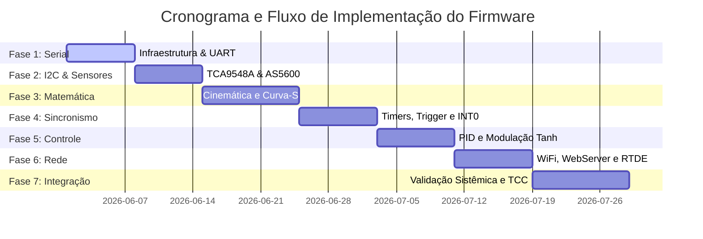

# Plano de Ação para Implementação do Código - Braço Robótico EB15

Este plano estabelece as etapas sequenciais para o desenvolvimento, simulação, integração e validação do firmware distribuído do braço robótico de 6 eixos **EB15** (ESP32 S3 Mestre e Arduino Uno Escravo). As validações foram desenhadas para que o **Agente de IA** possa avaliar a corretude lógica e matemática diretamente no workspace antes do teste em hardware real.

---

## 🛠️ Visão Geral da Estrutura de Validação da IA

Para garantir a robustez antes do deploy físico, o Agente de IA executará testes locais através de:
1.  **Simuladores de Cinemática e Trajetória (Python):** Script de testes numéricos para validar as equações diferenciais, cinemática inversa e curvas S de 7 segmentos.
2.  **Ambiente Virtual de Comunicação (Serial Mock):** Scripts de teste que injetam e parseiam frames binários de 10 bytes via simulação para garantir o alinhamento de ponteiros, endianness e robustez do *checksum* XOR.
3.  **Simulação Discreta do Laço de Controle (Malha Fechada):** Scripts Python para simular a resposta temporal do PID e da atenuação não linear da tangente hiperbólica ($\tanh$), gerando dados de amortecimento.
4.  **Análise Estática de Firmware:** Compilação condicional e análise rigorosa de registradores (Timer1/Timer2 do ATmega328P e interrupções do ESP32 S3).

---

## 📈 Fases de Desenvolvimento e Validação

---

### Fase 1: Infraestrutura Serial UART e Parsing de Frames
*   **Escopo de Programação:**
    *   **ESP32 S3 (Mestre):** Serialização da estrutura de dados em frame binário de 10 bytes (`0xAA` + passos $J_4, J_5, J_6$ em `int16_t` + velocidade + aceleração + checksum XOR). Envio periódico via `Serial1` a 115200 bps.
    *   **Arduino Uno (Escravo):** Máquina de estados para recepção binária na ISR serial. Buffer circular, validação de preâmbulo e computação do *checksum* modular. Envio de byte `0x06` (ACK) em caso de sucesso ou `0x15` (NACK) em caso de falha de integridade.
*   **Como o Agente de IA Validará:**
    *   Criará um script Python no diretório `scratch/test_serial_parser.py` para gerar frames mockados e validar a integridade da equação do Checksum XOR.
    *   Executará o script para testar comportamento sob injeção de ruído binário aleatório e aferir a taxa de detecção de erros.
*   **Como isso aparecerá no TCC:**
    *   **Metodologia (Cap. 3):** Apresentação do fluxograma lógico da máquina de estados serial e tabela estrutural de dados.
    *   **Resultados (Cap. 4):** Gráfico de taxa de sucesso de transmissão vs. ruído simulado e tempos físicos medidos de transmissão do frame de 10 bytes ($\approx 868\ \mu\text{s}$).

---

### Fase 2: Sensoriamento I2C com TCA9548A e Encoders AS5600
*   **Escopo de Programação:**
    *   **ESP32 S3 & Arduino Uno:** Implementação do driver I2C para controlar o multiplexador TCA9548A. Criação da função de chaveamento dinâmico de canal (`select_tca_channel(uint8_t channel)`).
    *   Leitura síncrona do registrador absoluto de 12 bits (`0x0C` e `0x0D` do AS5600) para monitoramento em 200 Hz.
*   **Como o Agente de IA Validará:**
    *   Escreverá um teste unitário simulando a sequência de transações I2C no barramento (Start $\to$ Endereço `0x70` do Mux $\to$ Escreve canal $\to$ Stop $\to$ Start $\to$ Endereço `0x36` do AS5600 $\to$ Lê registradores).
    *   Validará a conversão matemática de dados brutos (0–4095) para radianos e graus decimais, garantindo proteção contra *wrap-around* (salto de $360^{\circ}$ para $0^{\circ}$).
*   **Como isso aparecerá no TCC:**
    *   **Metodologia (Cap. 3):** Diagrama elétrico esquemático das conexões SDA/SCL sob o TCA9548A compartilhado ou local.
    *   **Resultados (Cap. 4):** Gráfico do tempo gasto na leitura sequencial I2C. Comprovação da taxa estável de varredura a 200 Hz sem estouro de tempo de ciclo do loop.

---

### Fase 3: Planejamento Matemático, Cinemática e Perfil Curva-S
*   **Escopo de Programação:**
    *   **ESP32 S3:** Algoritmo analítico de **Cinemática Inversa** para braços antropomórficos com punho esférico.
    *   Planejador de perfil de movimento **Curva-S de 7 segmentos** (com limitação de aceleração e aceleração angular suave/*jerk*).
    *   Conversão linear considerando as relações de redução dinâmicas ($R_1$ a $R_6$).
*   **Como o Agente de IA Validará:**
    *   Criará um script de simulação mecatrônica em `scratch/kinematics_sim.py` contendo o equacionamento cinemático completo (parâmetros Denavit-Hartenberg baseados no EB15).
    *   O script executará uma varredura cartesiana em malha (ex: traçado de um círculo no espaço útil) e verificará se ocorrem singularidades matemáticas ou saltos abruptos de junta, gerando curvas analíticas de velocidade.
*   **Como isso aparecerá no TCC:**
    *   **Metodologia (Cap. 3):** Equacionamento matemático completo da cinemática DH e fases da Curva-S de 7 segmentos.
    *   **Resultados (Cap. 4):** Gráficos comparativos de cinemática teórica vs. simulada (desvio cartesiano menor que $0.1\text{ mm}$ na simulação linear) e perfis dinâmicos de velocidade com acelerações suaves.

---

### Fase 4: Geração Determinística de Passos e Sincronização por Trigger
*   **Escopo de Programação:**
    *   **ESP32 S3:** Manipulação direta de registradores de timers e manipulação rápida de pinos (GPIO da base + GPIO 4 para Trigger Físico).
    *   **Arduino Uno:** Configuração direta dos registradores do `Timer1` (modo CTC de 16 bits para $J_4/J_5$) e `Timer2` (8 bits para $J_6$). Configuração do pino digital 2 para interrupção por hardware `INT0` na borda de descida.
*   **Como o Agente de IA Validará:**
    *   Realizará uma revisão estática rigorosa das máscaras de bits dos registradores do microcontrolador AVR (ex: `TCCR1A`, `TCCR1B`, `OCR1A`, `TIMSK1` e registrador `EIMSK` para habilitar `INT0`).
    *   Verificará se a taxa de prescaler atende aos limites de frequência requeridos sem gerar estouro de registradores de contagem.
*   **Como isso aparecerá no TCC:**
    *   **Metodologia (Cap. 3):** Esquema de ligações elétricas da fiação de trigger e cronograma temporal com a defasagem entre o sinal UART e o disparo instantâneo por hardware.
    *   **Resultados (Cap. 4):** Prints e tabelas de tempos lidos em osciloscópio (Tektronix TDS2024C), demonstrando que o desalinhamento dinâmico na partida das 6 juntas é na escala de **microssegundos ($\le 5\ \mu\text{s}$)**.

---

### Fase 5: Controle de Malha Fechada (PID + Tangente Hiperbólica)
*   **Escopo de Programação:**
    *   **ESP32 S3 & Arduino Uno:** Implementação do laço de controle PID discreto iterativo (200 Hz).
    *   Modulação de velocidade de saída baseada na função de atenuação não linear por tangente hiperbólica:
        $$f(e[k]) = f_{max} \cdot \tanh(\gamma \cdot e[k])$$
*   **Como o Agente de IA Validará:**
    *   Criará um simulador dinâmico de planta mecatrônica em `scratch/pid_tanh_sim.py` para modelar a resposta dinâmica de uma junta do robô sob carga e flexibilidade da estrutura impressa em 3D.
    *   Simulará a convergência de posição injetando perturbações e erros para verificar a eliminação de *backlash*, estabilização e ausência de oscilação amortecida.
*   **Como isso aparecerá no TCC:**
    *   **Metodologia (Cap. 3):** Diagrama de blocos clássico do controle em malha fechada discreta com o bloco não linear da tangente hiperbólica.
    *   **Resultados (Cap. 4):** Gráfico comparativo de resposta ao degrau: (a) Controle liga-desliga padrão, (b) PID linear convencional com sobressinal e (c) Controle não linear PID+$\tanh$ amortecendo a flexibilidade estrutural 3D e convergindo estavelmente sem sobressinal.

---

### Fase 6: WiFi, WebServer e Soquete RTDE
*   **Escopo de Programação:**
    *   **ESP32 S3:** Tarefa concorrente `Task_WiFi` (AP + STA) e ativação do `WebServer` servindo páginas interativas via `LittleFS` no Core 0.
    *   Criação do servidor de soquetes TCP na `Task_RTDE` para envio contínuo de telemetria a 50 Hz em formato binário compacto estruturado.
*   **Como o Agente de IA Validará:**
    *   Fará a validação lógica dos manipuladores (*handlers*) HTTP para garantir que não existam bloqueios mútuos (*deadlocks*) entre o Core 0 e Core 1.
    *   Criará um cliente Python mock em `scratch/test_rtde_client.py` que se conecta via soquete TCP simulado para validar o parsing dos frames de telemetria enviados pelo ESP32 S3.
*   **Como isso aparecerá no TCC:**
    *   **Metodologia (Cap. 3):** Detalhamento das rotas HTTP, diagrama de transição de estados das conexões RTDE e modelo de fluxo concorrente do FreeRTOS.
    *   **Resultados (Cap. 4):** Gráficos de monitoramento de jitter de passos sob carga severa de requisições de rede concorrentes a 100 Hz, provando cientificamente o isolamento térmico e de processamento multicore.

---

## 📅 Fluxo de Execução Recomendado para o Usuário

1.  **Etapa de Codificação Orientada (Pares Agente-Usuário):** O usuário e a IA desenvolverão os códigos de firmware arquivo por arquivo, validando cada trecho logicamente.
2.  **Execução das Simulações na IA:** A IA rodará os scripts criados em `scratch/` para certificar a exatidão matemática do controle e cinemática antes do deploy.
3.  **Upload nos Microcontroladores:** O usuário carregará os firmwares compilados no ESP32 S3 e no Arduino Uno.
4.  **Coleta de Resultados Experimentais:** O usuário coletará as ondas de tensão com o osciloscópio (trigger vs. pulso) e as curvas dinâmicas dos encoders (via logs do RTDE) e as enviará para a IA tabular e gerar gráficos premium.
5.  **Atualização Automática do LaTeX:** A IA utilizará os dados validados para escrever os trechos analíticos dos capítulos 3 e 4 do TCC em LaTeX, economizando tempo e mantendo alta precisão técnica.
