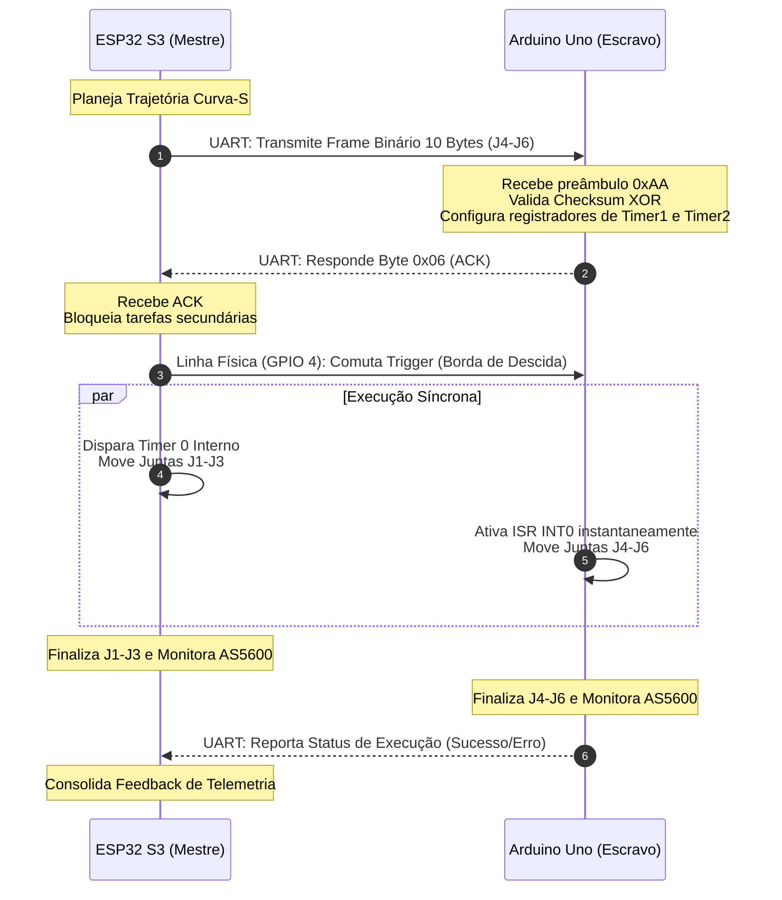

# Requisitos de Software e Código - Braço Robótico EB15

Este documento apresenta a especificação técnica detalhada de todos os requisitos lógicos, funcionais e não funcionais que devem ser atendidos pelo firmware do braço robótico de 6 eixos **EB15**, com base na arquitetura de controle distribuído entre o **Nó Mestre (ESP32 S3)** e o **Nó Escravo (Arduino Uno)**.

---

## 1. Visão Geral da Arquitetura de Software

Para mitigar o gargalo de processamento decorrente de conexões Wi-Fi assíncronas e telemetria de alta frequência concorrendo com a geração determinística de passos em tempo real, o sistema é particionado logicamente:

```mermaid
graph TD
    subgraph ESP32 S3 (Nó Mestre - Supervisor)
        Core0[Core 0: Tarefas Assíncronas]
        Core1[Core 1: Tempo Real Crítico]
        
        Core0 --> WiFi[Task_WiFi: AP + STA]
        Core0 --> WebServer[Task_WebServer: HTTP & LittleFS]
        Core0 --> RTDE[Task_RTDE: TCP Socket 50Hz]
        
        Core1 --> BaseControl[Task_BaseControl: 200Hz - Hardware Timer 0]
        Core1 --> SerialComm[Task_SerialComm: Envio UART & Handshake]
        
        BaseControl --> EncodersMestre[Varredura I2C: Encoders J1-J3]
        BaseControl --> DriversMestre[Pulsos Físicos: TB6600 J1-J3]
    end

    subgraph Interconexão de Controle
        UART[UART: 115200 bps - Divisor de Tensão 5V para 3.3V]
        Trigger[Trigger Digital: GPIO 4 -> INT0 / Pino 2]
        SerialComm -->|Frame Binário 10 Bytes| UART
        SerialComm -->|Trigger Sincronismo| Trigger
    end

    subgraph Arduino Uno (Nó Escravo - Executor)
        BareMetal[Laço Bare-metal: Sem RTOS]
        Timer1[Timer 1: CTC 16-bit J4/J5]
        Timer2[Timer 2: 8-bit J6]
        ISR_INT0[ISR INT0: Borda de Descida]
        
        UART -->|Recepção e Checksum| BareMetal
        Trigger -->|Interrupção Externa| ISR_INT0
        ISR_INT0 -->|Disparo Instantâneo| Timer1 & Timer2
        Timer1 & Timer2 --> DriversEscravo[CNC Shield v3.1: A4988 J4-J6]
        BareMetal --> EncodersEscravo[Varredura I2C: Encoders J4-J6]
    end
```

---

## 2. Requisitos Funcionais (RF)

### 2.1. Do Nó Mestre (ESP32 S3)

#### RF01 - Particionamento Multicore via FreeRTOS
*   **Descrição:** O firmware do ESP32 S3 deve utilizar o sistema operacional FreeRTOS para isolar estritamente tarefas de alta prioridade de tempo real das tarefas assíncronas de conectividade.
*   **Critérios de Aceite:**
    *   **Core 0:** Reservado exclusivamente para `Task_WiFi` (prioridade 3), `Task_WebServer` (prioridade 2) e `Task_RTDE` (prioridade 4).
    *   **Core 1:** Reservado para `Task_BaseControl` (prioridade 10) e `Task_SerialComm` (prioridade 8).
    *   O escalonador preemptivo não deve permitir que o tráfego de rede afete a execução da `Task_BaseControl`.

#### RF02 - Laço de Controle Determinístico (Task_BaseControl)
*   **Descrição:** A tarefa de controle de movimento e realimentação no Core 1 deve ser acionada em um período fixo de amostragem por meio de interrupção por timer de hardware.
*   **Critérios de Aceite:**
    *   Frequência de execução fixada em **200 Hz** (período de $5\text{ ms} \pm 50\ \mu\text{s}$) atrelada ao `Hardware Timer 0` do ESP32 S3.
    *   Processamento local de leitura I2C de J1, J2, J3, cálculo PID, modulação $\tanh$ e comutação rápida de GPIOs dos drivers TB6600.

#### RF03 - Servidor Web Embarcado e LittleFS
*   **Descrição:** O ESP32 S3 deve hospedar um servidor HTTP para servir a interface gráfica de teleoperação em tempo real.
*   **Critérios de Aceite:**
    *   Arquivos estáticos da interface (HTML, CSS, JS) compilados e armazenados no sistema de arquivos **LittleFS** na memória Flash.
    *   Suporte a conexões simultâneas de clientes sem degradação do processamento de movimento.
    *   Endpoints específicos para leitura/gravação de arquivos JSON de parametrização dinâmica.

#### RF04 - Planejamento Global de Trajetória e Cinemática
*   **Descrição:** O ESP32 S3 deve realizar o cálculo matemático centralizado da movimentação cartesiana de todas as 6 juntas articuladas.
*   **Critérios de Aceite:**
    *   Resolução em tempo real da **Cinemática Inversa** para mapeamento de alvos cartesianos $(X, Y, Z, Roll, Pitch, Yaw)$ para ângulos de junta $(\theta_1$ a $\theta_6)$.
    *   Interpolação de trajetória contínua em **Curva-S de 7 segmentos**, calculando os perfis dinâmicos de velocidade, aceleração e *jerk* (solavanco) limites.
    *   Conversão matemática dos ângulos teóricos planejados para número exato de passos mecânicos considerando as relações de redução independentes ($R_1$ a $R_6$).

---

### 2.2. Do Nó Escravo (Arduino Uno)

#### RF05 - Firmware Bare-Metal com Timers de Hardware
*   **Descrição:** O código do Arduino Uno deve ser estruturado em C puro, livre de sistemas operacionais, para assegurar jitter mínimo na geração física de pulsos.
*   **Critérios de Aceite:**
    *   A geração de frequências de passo para as juntas J4 e J5 deve utilizar o **Timer 1 (16 bits)** configurado no modo **CTC** (*Clear Timer on Compare Match*).
    *   A junta J6 (atuação da garra) deve ser controlada utilizando o **Timer 2 (8 bits)** com prescaler dedicado.
    *   O laço principal (`main loop`) deve priorizar a atualização de realimentação I2C e escuta de interrupção serial UART.

#### RF06 - Interrupção Externa de Sincronismo (INT0)
*   **Descrição:** A partida da contagem de passos dos timers no Arduino Uno deve ocorrer estritamente após a recepção física de um trigger digital.
*   **Critérios de Aceite:**
    *   Configuração do pino digital 2 (interrupção INT0 do ATmega328P) para detecção de **Borda de Descida** (*Falling Edge*).
    *   Na Rotina de Serviço de Interrupção (ISR) associada a INT0, os registradores dos Timers 1 e 2 devem ser ativados de imediato para disparar a movimentação em microssegundos de latência.

---

### 2.3. Da Comunicação, Sincronização e Feedback

#### RF07 - Protocolo Serial UART Compactado
*   **Descrição:** O canal serial assíncrono deve operar com dados binários estruturados de tamanho fixo para atenuar atrasos na latência de transmissão.
*   **Critérios de Aceite:**
    *   Taxa de transmissão estabelecida em **115200 bps** (tempo máximo de envio físico de frame inferior a $1\text{ ms}$).
    *   Estrutura de pacote binário de exatamente **10 Bytes**, conforme tabela abaixo:

| Byte Posição | Campo Técnico | Tipo de Dado | Descrição |
| :---: | :---: | :---: | :--- |
| 0 | Preâmbulo Sync | `uint8_t` | Padrão fixo de sincronismo elétrico (`0xAA`) |
| 1--2 | Passos Junta J4 | `int16_t` | Número de passos discretos para a Junta J4 (com sinal) |
| 3--4 | Passos Junta J5 | `int16_t` | Número de passos discretos para a Junta J5 (com sinal) |
| 5--6 | Passos Junta J6 | `int16_t` | Número de passos discretos para a Junta J6 (com sinal) |
| 7 | Parâmetro Velocidade | `uint8_t` | Índice de frequência máxima mapeada do Timer |
| 8 | Parâmetro Aceleração | `uint8_t` | Rampa de aceleração dinâmica sintonizada |
| 9 | Soma Modular Checksum | `uint8_t` | Verificação de integridade física (*XOR* cumulativo dos bytes 0 a 8) |

#### RF08 - Fluxo de Handshake e Disparo por Hardware
*   **Descrição:** As placas devem seguir um protocolo de estado elétrico e lógico bidirecional para assegurar o alinhamento mecânico na partida de todas as juntas.
*   **Critérios de Aceite:**
    *   **Passo 1 (Envio):** O ESP32 S3 envia o frame de 10 bytes via UART e bloqueia sua rotina de acionamento.
    *   **Passo 2 (Preparação):** O Arduino Uno faz o parsing, confere o *checksum*, configura os contadores e responde com o byte ASCII `0x06` (ACK).
    *   **Passo 3 (Disparo):** Ao receber `0x06`, o ESP32 S3 altera imediatamente o estado elétrico da linha física dedicada de trigger (GPIO 4 $\to$ de 5V para 0V).
    *   **Passo 4 (Execução):** Ambas as placas iniciam a comutação de micropassos simultaneamente no mesmo microssegundo.
    *   **Passo 5 (Reporte):** O Arduino Uno retorna pela UART o status da tarefa concluída para que o ESP32 libere o controle global.



#### RF09 - Monitoramento em Malha Fechada Realimentada (AS5600) via Multiplexador TCA9548A
*   **Descrição:** O sistema deve ler os sensores magnéticos absolutos AS5600 para monitorar erros posicionais e folgas de transmissão mecânica em tempo real. Devido ao endereço I2C fixo (`0x36`) de todos os sensores, deve ser utilizado um multiplexador I2C **TCA9548A de 8 canais** para chaveamento de barramento.
*   **Critérios de Aceite:**
    *   Varredura dos encoders em barramento serial **I2C Fast Mode** operando a **400 kHz** através do multiplexador TCA9548A (endereço I2C padrão `0x70`).
    *   A seleção de qual sensor ler deve ser feita por software enviando o comando de ativação do canal correspondente (Canais 0 a 5) ao TCA9548A antes de iniciar a transação de leitura.
    *   Disposição física: Os sensores devem ser fixados diretamente nos elos móveis de saída *após* a redução mecânica, colhendo o ângulo cartesiano efetivo da junta.
    *   **ESP32 S3:** Varre as juntas J1, J2 e J3 (canais 0, 1 e 2 do multiplexador) na taxa de 200 Hz.
    *   **Arduino Uno:** Varre as juntas J4, J5 e J6 (canais 3, 4 e 5 do multiplexador) na taxa de 200 Hz.

#### RF10 - Modulação de Frequência Não Linear por Tangente Hiperbólica
*   **Descrição:** O erro posicional instantâneo coletado de cada junta deve alimentar o cálculo de controle para suavização de ressonância dinâmica.
*   **Critérios de Aceite:**
    *   Cálculo do erro instantâneo da junta:  
        $$e[k] = \theta_{des}[k] - \theta_{real}[k]$$
    *   Execução do algoritmo clássico PID discreto de posição a cada $5\text{ ms}$:  
        $$u[k] = K_p e[k] + K_i \sum_{j=0}^{k} e[j] \Delta t + K_d \left( \frac{e[k] - e[k-1]}{\Delta t} \right)$$
    *   Aplicação de modulação em frequência de passo por **Tangente Hiperbólica**:  
        $$f(e[k]) = f_{max} \cdot \tanh(\gamma \cdot e[k])$$
    *   Para desvios grandes, o valor deve saturar no patamar $f_{max}$ (velocidade de regime).
    *   Para erros próximos a zero, a frequência deve decair suavemente de forma exponencial, amortecendo elasticidades mecânicas do braço estrutural 3D.

#### RF11 - Protocolo de Conectividade RTDE (Real-Time Data Exchange)
*   **Descrição:** O ESP32 S3 deve dispor de uma porta de escuta TCP para troca de dados bidirecional de alto desempenho com computadores externos.
*   **Critérios de Aceite:**
    *   Habilitação de uma conexão TCP estável na porta padrão configurada.
    *   Ciclo de telemetria a **50 Hz** enviando pacotes contendo: posições angulares reais de todas as 6 juntas (graus), erros de rastreamento PID, estimativa de corrente dos drivers e temperatura embarcada.
    *   Capacidade de aceitar alvos de controle cartesiano remoto com parsing rápido.

---

## 3. Requisitos Não Funcionais (RNF)

### RNF01 - Estabilidade Temporal (Jitter Limite)
*   **Descrição:** A variação no período de emissão dos pulsos de passo não deve causar ressonância destrutiva nos enrolamentos magnéticos dos motores de passo.
*   **Critérios de Aceite:**
    *   O jitter temporal máximo tolerado na geração de pulsos de passos é de **$\pm 5\%$** do período sob regime de tráfego intenso de rede na placa ESP32 S3 (testado via osciloscópio Tektronix TDS2024C sob estresse de requisições HTTP e RTDE simultâneas a 100 Hz).

### RNF02 - Proteção Elétrica e Compatibilidade de Tensão
*   **Descrição:** As portas de entrada e saída lógicas do microcontrolador ESP32 S3 devem ser eletricamente protegidas contra a amplitude de sinal do Arduino Uno.
*   **Critérios de Aceite:**
    *   A linha física de transmissão TX (5V TTL) do Arduino Uno ao pino RX (3.3V CMOS) do ESP32 S3 deve incluir um **divisor de tensão resistivo simétrico de alta velocidade** composto por resistores de $1\text{ k}\Omega$ em série e $2\text{ k}\Omega$ em paralelo ao terra físico.
    *   A tensão nominal resultante no pino do ESP32 S3 deve se manter no patamar estável de $3{,}33\text{ V}$, respeitando o limite máximo admissível de entrada lógica.

### RNF03 - Velocidade de Transmissão da Interconexão
*   **Descrição:** A latência física total de barramento induzida pelo canal de dados UART de interligação não deve comprometer o sincronismo da cinemática.
*   **Critérios de Aceite:**
    *   Uso estrito de baud rate estável a **115200 bps**.
    *   O tempo total de transmissão do frame de controle de 10 bytes (100 bits físicos com start/stop bits) deve ser estritamente inferior a **$900\ \mu\text{s}$**.

### RNF04 - Confiabilidade da Transmissão e Tratamento de Erros
*   **Descrição:** O sistema deve prevenir a execução de movimentos espúrios decorrentes de ruídos de barramento serial na linha UART.
*   **Critérios de Aceite:**
    *   O Arduino Uno deve computar a paridade acumulada de todos os bytes recebidos por operação binária OR Exclusiva (XOR).
    *   Se o byte final do checksum divergir do valor computado, a configuração da trajetória deve ser ignorada, o movimento das juntas superiores mantido em bloqueio de segurança e um relatório de erro (`NACK` ou código específico) enviado ao mestre.

### RNF05 - Resolução Angular de Atuação e Feedback (Micropasso 1/4)
*   **Descrição:** Os subsistemas de controle e sensoriamento devem operar em resoluções compatíveis para balancear fluidez e entrega de torque estável.
*   **Critérios de Aceite:**
    *   Os drivers industriais TB6600 e os módulos A4988 devem ser configurados em modo de **micropasso de 1/4** por hardware. Esta escolha é mandatória para **diminuir a perda de força nos pulsos** (preservando o torque mecânico) e evitar perda de passos sob carga.
    *   Os encoders magnéticos absolutos AS5600 devem operar em resolução nativa de **12 bits** (4096 divisões por volta, correspondendo a uma resolução real de $0{,}088^{\circ}$ por divisão).

---

## 4. Matriz de Rastreabilidade de Hardware vs Software

| Junta | Atuador Físico | Driver de Potência | Tensão Potência | Microcontrolador Responsável | Canal de Feedback (AS5600 via TCA9548A) |
| :---: | :---: | :---: | :---: | :---: | :---: |
| **J1** (Base) | NEMA 17 | TB6600 (Micropasso 1/4) | 12 V | ESP32 S3 (Mestre - Core 1) | TCA9548A - Canal 0 (Endereço 0x36) |
| **J2** (Ombro) | NEMA 17 | TB6600 (Micropasso 1/4) | 12 V | ESP32 S3 (Mestre - Core 1) | TCA9548A - Canal 1 (Endereço 0x36) |
| **J3** (Cotovelo) | NEMA 17 | TB6600 (Micropasso 1/4) | 12 V | ESP32 S3 (Mestre - Core 1) | TCA9548A - Canal 2 (Endereço 0x36) |
| **J4** (Rotação Punho)| NEMA 17 | A4988 / CNC Shield (1/4) | 12 V | Arduino Uno (Escravo - Timers) | TCA9548A - Canal 3 (Endereço 0x36) |
| **J5** (Flexão Punho) | NEMA 17 | A4988 / CNC Shield (1/4) | 12 V | Arduino Uno (Escravo - Timers) | TCA9548A - Canal 4 (Endereço 0x36) |
| **J6** (Atuação Garra) | NEMA 17 | A4988 / CNC Shield (1/4) | 12 V | Arduino Uno (Escravo - Timers) | TCA9548A - Canal 5 (Endereço 0x36) |
